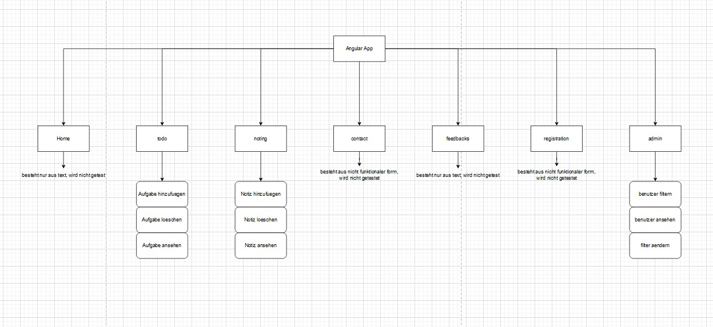
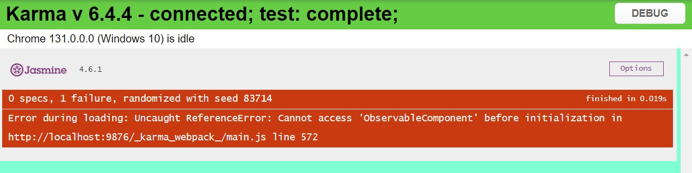

## Grobe Architektur visualisiert

I used Draw.io to create a some sort of a diagram, displaying the structure of the project. Additionally information about each components were added too, including whether they shall be tested. 

## Testkonzept

The test concept was documented in Word, covering test items, features to be tested, features not to be tested, approach, and other key details. It serves as a plan and a reference while working on each task.

### Why a Testkonzept is Needed
- Clear Scope: Defines what will and won’t be tested, avoiding wasted effort on unnecessary areas.
- Organized Approach: Provides a step-by-step plan, ensuring tasks are completed systematically.
- Consistency: Helps maintain uniform testing standards throughout the project.
- Better Communication: Acts as a shared reference for understanding the testing process, useful if others join the project.
- Quality Assurance: Ensures all critical features are tested, reducing the risk of bugs or missed functionality.

## Wahl der Testfälle (Komponententests)

### Todo Component
- Normal Cases:
  - Adding a todo: Make sure a valid item gets added to the list.
  - Deleting a todo: Check that items are removed properly.
  - Rendering: Confirm the todo list displays as expected.

- Edge Cases:
  - Adding empty or blank input: Shouldn’t add anything to the list.
  - Removing from an empty list: Shouldn’t cause any errors or crashes.

### Noting Component
- Normal Cases:
  - Adding a note: Ensure valid input adds the note correctly.
  - Deleting a note: Confirm it removes the right item.

- Edge Cases:
  - Adding empty or blank input: Shouldn’t allow anything to be added.
  - Removing a note that doesn’t exist: No errors or unexpected issues.

### Observable (Admin) Component
- Normal Cases:
  - Filtering users: Check that only users matching the filter are shown.
  - Rendering: Make sure the filtered list is displayed properly.
  - Viewing users: Verify navigation works when viewing user details.

- Edge Cases:
  - No users match the filter: Should show an empty list, not crash.
  - Extreme filters (e.g., 0 or 100): Should still behave logically.

---

## Einsatz Mocking Framework

Mocking was used where it made sense, avoiding anything unnecessary.

### Where Mocking Was Used
- Router Service: The Router was mocked in the Observable component to simulate navigation.
- Behavior: Checked that navigation methods were called with the correct arguments.
- No unnecessary mocks: Todo and Noting components didn’t need mocks, so none were added.

---

## Automatisierung des Testings (Ausführung)

### CI/CD Pipeline Overview
- A CI/CD pipeline was set up using **GitHub Actions**.
- The pipeline runs automatically on:
  - Pushes to the `main` branch.
  - Pull Requests into the `main` branch.

### Pipeline Steps
1. Fetches the latest code from the repository.
2. Sets up Node.js.
3. Runs `npm install` to install dependencies.
4. Executes `ng test` in headless mode.
5. Builds the app.

### Execution
- The pipeline is triggered by commit / pull request.
- Tests run automatically.

---

## Automatisierung des Testings (Dokumentation)

Running `ng test` generates test logs and a report from Karma:

---

## Reflexion über Code Reviews und TDD

### Code Reviews
I worked alone, so code reviews weren’t possible, but here’s how they could’ve helped:
- Catch Mistakes: A teammate might spot issues I didn’t notice.
- Improve Code Quality: Make the code cleaner and easier to maintain.
- Knowledge Sharing: Help everyone understand the codebase better.
- Consistency: Enforces standards.

### Test-Driven Development (TDD)
TDD works well in certain situations:
- When It’s Useful:
  - Important features: Writing tests first ensures critical functionality works properly.
  - Complex logic: Helps plan how the code should behave before writing it.
  - Incremental changes: Makes sure new features don’t break existing functionality.
- When It’s Less Useful:
  - Simple projects: Writing tests first is overkill.
  - Speed: Slows things down.

## Test-Driven Development for Edit Button

### step 1
Write a test case for the new edit feature:
- Clicking the "Edit" button shows an input field for editing.
- The updated value is saved when the "Save" button is clicked.
- The changes are rendered in the template.
- Making sure the "Cancel" button restores the original value without saving.

### Step 2: Coding the Feature
Implement the edit feature:
- Added `editingIndex` to track the todo being edited.
- Added `editingTodo` for temporary edits.
- Created methods: `startEditing(index)`, `saveEdit()`, and `cancelEdit()`.
- Used `*ngIf` to toggle between text and input.
- Added "Edit," "Save," and "Cancel" buttons.

Difficulties: aligning the code with the test

## Arbeiten mit GIT

At first, GIT didn't work, due to some sub-repository or some sort, so I created a new project and pasted the src directory into the new project instead. Since then, GIT was working normally. Github helped greatly at creating the CI/CD pipeline. 